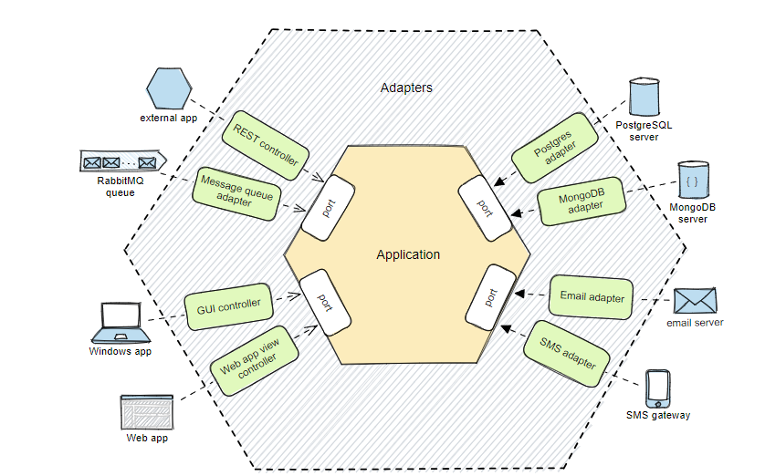

<!--markdownlint-disable MD013-->
# Шаблон для Golang проектов

## Про архитектуру

В данном шаблоне используется [*гексагональная архитектура*](https://habr.com/ru/companies/timeweb/articles/771338/).



На бекенде часть **бизнес-логика оказывается связанной с
базой данных или со внешними библиотеками и сервсами**.
Это затрудняет тестирование логики из-за сильной связи компонентов.
Также затруднительно переходить от одной технологии к другой.

Основная идея гексагональной архитектуры - отделить бизнес-логику от зависимостей.
Вся бизнес-логика заключена внутри приложения, а все внешние сущности — за его пределами.
Внутренняя часть приложения не должна знать о внешней.

### Порты и адаптеры

Чтобы отделить бизнес-логику от внешнего мира, сделаем так, чтобы приложение взаимодействовало с внешним миром только через **порты**.
Эти порты описывают суть коммуникации между двумя сторонами.
Для приложения не имеет значения, каковы технические детали реализации портов.

**Адаптеры** обеспечивают связь приложения с внешним миром.
Они преобразуют внешние сигналы в форму, понятную приложению.
Адаптеры взаимодействуют с приложением только через порты.

### Пример гексагональной архитектуры для Go проекта

```md
.
├── cmd
├── internal
│   ├── adapters
│   │   ├── db
│   │   ├── grpc
│   │   └── http
│   ├── app
│   │   ├── application.go
│   │   └── ports
│   │       ├── input
│   │       └── output
│   └── domain
│       ├── entities
│       ├── exceptions
│       └── services
└── pkg
```

Шаблон делится на три основные состовляющие:

- **app**: описание архитектуры приложения(само приложение  и порты);
- **domain**: описание бизнес-логики(сущности, сервисы и кастомные ошибки);
- **adapters**: внешние адаптеры независимые от приложения.

В приложении описываются порты - *input* и *output*.

В *input* содержатся интерфейсы, которые бизнес-логика ожидает для взаимодействия с внешним миром.
Например: `UserService`.
Реализация данных интерфейсов находится в `domain/services`.

В *output* содержатся интерфейсы для работы с внешними компонентами, такими как БД или API.
Например: `UserRepository`.
Реализация данных интерфейсов находится в `adapters`.

## Про шаблон проекта

Скоро будет...
